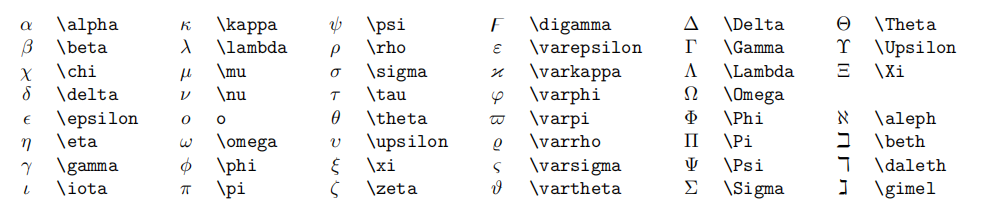

# Hello, World!
``` C++ {.line-numbers}
function add(x, y) {
  return x + y
}
```
> 引用别人说的话
> 就这样写
1. 有序列表 1
   1. 嵌套有序列表 1
   2. 嵌套有序列表 2
2. 有序列表 2
3. 有序列表 3
   
| 表头 | 表头 |
| ---- | ---- |
| 内容 | 内容 |
| 内容 | 内容 |

三条横线 (或更多的横线) 表示分割线.

---
- [x] 已经完成的事 1
- [x] 已经完成的事 2
- [x] 已经完成的事 3
- [ ] 仍未完成的事 4
- [ ] 仍未完成的事 5
[Jia258's Blog](https://blog.yansijia.top/)


| 表头 | 表头 |
| ---- | ---- |
| 内容 | 内容 |
| >    | 内容 |

| 表头 | 表头 |
|------|-----|
| 内容 | 内容 |
| ^    | 内容 |

行内公式: 
单位圆 $x^2+y^2=1$

公式块:
$$
\begin{cases}
x=\rho\cos\theta \\
y=\rho\sin\theta \\
x
\end{cases}
$$

较小的行内行分数 $\frac{1}{2}$
展示型的分式 $\displaystyle\frac{x+1}{x-1}$

开 $n$ 次方 $\sqrt[n]{2}$

紧贴 $a\!b$

没有空格 $ab$

小空格 $a\,b$

中等空格 $a\;b$

大空格 $a\ b$

quad 空格 $a\quad b$

两个 quad 空格 $a\qquad b$

累加 $\sum_{k=1}^n\frac{1}{k}  \quad  \displaystyle\sum_{k=1}^n\frac{1}{k}$

累乘 $\prod_{k=1}^n\frac{1}{k}  \quad  \displaystyle\prod_{k=1}^n\frac{1}{k}$

积分 $\displaystyle\int_0^1x{\rm d}x  \quad  \iint_{D_{xy}}  \quad  \iiint_{\Omega_{xyz}}$

极限 $\displaystyle\lim_{x\to \infty}$

用 \left 和 \right 可以让括号适配内部大小

圆括号 $\displaystyle \left(\sum_{k=1}^{n}\frac{1}{k} \right)^2$

方括号 $\displaystyle \left[\sum_{k=1}^{n}\frac{1}{k} \right]^2$

花括号 $\displaystyle \left\{\sum_{k=1}^{n}\frac{1}{k} \right\}^2$

尖括号 $\displaystyle \left\langle\sum_{k=1}^{n}\frac{1}{k} \right\rangle^2$

居中:

$$
\begin{aligned}
y &=(x+5)^2-(x+1)^2 \\
&=(x^2+10x+25)-(x^2+2x+1) \\
&=8x+24 \\
\end{aligned}
$$

左对齐:

$
\begin{aligned}
y &=(x+5)^2-(x+1)^2 \\
&=(x^2+10x+25)-(x^2+2x+1) \\
&=8x+24 \\
\end{aligned}
$

$$
\begin{cases}
k_{11}x_1+k_{12}x_2+\cdots+k_{1n}x_n=b_1 \\
k_{21}x_1+k_{22}x_2+\cdots+k_{2n}x_n=b_2 \\
\cdots \\
k_{n1}x_1+k_{n2}x_2+\cdots+k_{nn}x_n=b_n \\
\end{cases}
$$

矩阵:

$$
{\begin{matrix}
\begin{pmatrix}
1 & 1 & \cdots & 1 \\
1 & 1 & \cdots & 1 \\
\vdots & \vdots & \ddots & \vdots \\
1 & 1 & \cdots & 1 \\
\end{pmatrix}
&
\begin{bmatrix}
1 & 1 & \cdots & 1 \\
1 & 1 & \cdots & 1 \\
\vdots & \vdots & \ddots & \vdots \\
1 & 1 & \cdots & 1 \\
\end{bmatrix}
\end{matrix}}
$$

行列式: 

$$
\begin{vmatrix}
1 & 1 & \cdots & 1 \\
1 & 1 & \cdots & 1 \\
\vdots & \vdots & \ddots & \vdots \\
1 & 1 & \cdots & 1 \\
\end{vmatrix}
$$

$$
x+2 \tag{1.2}
$$

$$
\begin{equation}
x^n+y^n=z^n
\end{equation}
$$

由公式 $(1.2)$ 可得到结论

点乘 $\cdot$, 叉乘 $\times$, 异或 $\otimes$, 直和 $\oplus$, 加减 $\pm$, 复合 $\circ$.
小于等于 $\leq$, 大于等于 $\geq$, 不等 $\neq$, 恒等 $\equiv$, 约等 $\approx$, 等价 $\cong$, 相似 $\sim$, 相似等于 $\simeq$, 点等 $\doteq$.
逻辑与 $\land$, 逻辑或 $\lor$, 逻辑非 $\lnot$, 蕴涵 $\to$, 等价 $\leftrightarrow$.
因为 $\because$, 所以 $\therefore$, 存在 $\exist$, 任意 $\forall$.
左小箭头 $\leftarrow$, 右小箭头 $\rightarrow$, 左大箭头 $\Leftarrow$, 右大箭头 $\Rightarrow$, 右长箭头 $\xrightarrow[fgh]{abcde}$.
属于 $\in$, 包含于 $\subset$, 真包含于 $\subseteq$, 交 $\cap$, 并 $\cup$, 空集 $\empty$
短向量 $\vec{x}$, 长向量 $\overrightarrow{AB}$, 上横线 $\overline{p}$.
无限 $\infty$, 极限 $\lim$, 微分 ${\rm d}$, 偏导 $\partial$, 点求导 $\dot{y}$, 点二阶导 $\ddot{y}$, 变化量 $\Delta$, 梯度 $\nabla$.
横省略 $\cdots$, 竖省略 $\vdots$, 斜省略 $\ddots$.
常见函数 $\sin$, $\cos$, $\tan$, $\arcsin$, $\arccos$, $\arctan$, $\ln$, $\log$, $\exp$.



VSCode 快捷键
快捷键是用 VSCode 记笔记的精髓之一, 每一个都非常重要!

原生快捷键
通用操作
Ctrl + C, 复制当前文本
Ctrl + V, 粘贴当前文本
Ctrl + Z, 撤销
Ctrl + Shift + Z, 反撤销
Shift + Alt + F, 整理代码
Ctrl + /, 将当前行注释 / 反注释, 当多行文本被选中时, 将多行文本注释
光标操作
Ctrl + ← 将光标向左移动一个单词
Ctrl + → 将光标向右移动一个单词
Ctrl + Alt + ↑, 向上加入一个光标
Ctrl + Alt + ↓, 向下加入一个光标
Ctrl + Alt + U, 撤销上次光标操作
界面移动
Ctrl + ↑ 向上移动当前界面
Ctrl + → 向下移动当前界面
选中操作
Shift + ← 向左选中 / 反选中一个字符(重要)
Shift + → 向右选中 / 反选中一个字符(重要)
Ctrl + Shift + ← 向左选中 / 反选中一个单词(重要)
Ctrl + Shift + → 向右选中 / 反选中一个单词(重要)
Ctrl + D当前有选中文本时, 将下一个与其相同的文本加入选中 (重要)
文本行操作
Ctrl + C当前无选中文本时, 复制当前行
Shift + Alt + ↑ 向上复制当前行, 当多行文本被选中时, 向上复制多行 (重要)
Shift + Alt + ↓ 向下复制当前行, 当多行文本被选中时, 向下复制多行 (重要)
Alt + ↑ 向上移动当前行, 当多行文本被选中时, 将当前多行文本向上移动 (重要)
Alt + ↓ 向下移动当前行, 当多行文本被选中时, 将当前多行文本向下移动 (重要)


插件增加的快捷键
Markdown 语法
Ctrl + B当前有选中文本时, 将文本加粗
Ctrl + I当前有选中文本时, 将文本变为斜体
Ctrl + M 进入数学公式模式 (加入美元符)
图片粘贴
Ctrl + Alt + V 粘贴剪贴板图片 (本地)
Ctrl + Alt + V 粘贴剪贴板图片 (图床)
光标操作
Ctrl + Alt + U 将多选光标变为单选
选中操作
Shift + Alt + ← 向左复制当前选中文本 (重要)
Shift + Alt + → 向右复制当前选中文本 (重要)
Alt + ← 向左移动当前选中文本一个字符(重要)
Alt + → 向右移动当前选中文本一个字符(重要)
Ctrl + Alt + ← 向左移动当前选中文本一个单词(重要)
Ctrl + Alt + → 向右移动当前选中文本一个单词(重要)
计算器功能
Ctrl + Shift + Alt + E 计算当前选中表达式, 用等号连接并输出
Ctrl + Shift + Alt + R 计算当前选中表达式, 并替换当前选中表达式
Ctrl + Shift + Alt + D 定义当前选中表达式, 无输出
Python Brackets 带来的括号操作
Ctrl + Shift + Backspace 删除匹配的括号
Ctrl + Shift + / 选择匹配的括号

只要选择一段公式表达式文本，然后按下快捷键 Ctrl ＋ Shift + E 就看得出计算结果。

目前支持功能: 数值计算，符号运算，求导，求积分，矩阵计算，矩阵初等变换 等功能。